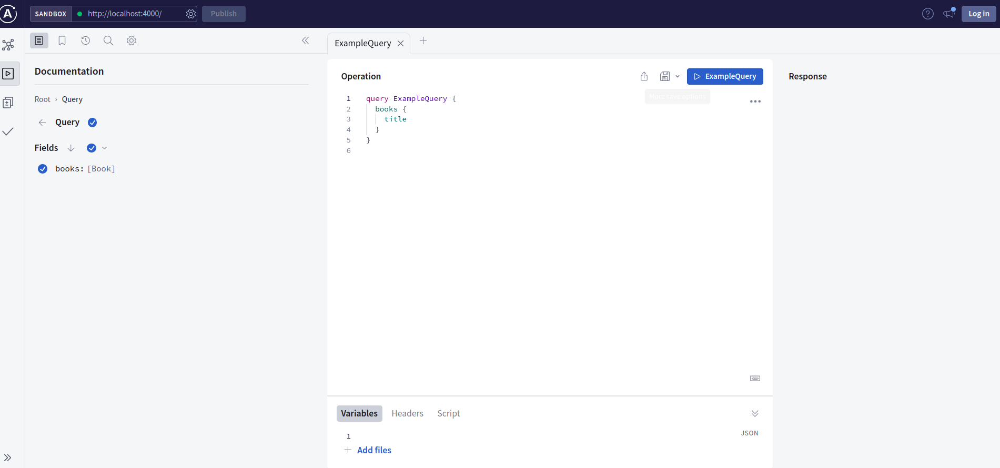

###    Full installation instructions.

-    https://www.apollographql.com/docs/apollo-server/getting-started

### Run the server
- `npm start` 
- [🚀 Server ready at: http://localhost:4000/]

@@ The server looks like
