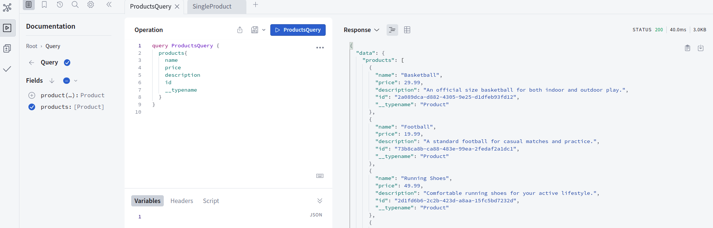

###    Branches:

- 0🏷️ [Main](https://github.com/bappasahabapi/graphQL)
- 1🏷️ [Products](https://github.com/bappasahabapi/graphQL/tree/bappa/01/schema)
- 2🏷️ [Project File Structure](https://github.com/bappasahabapi/graphQL/tree/bappa/02/file-structure)

###    Full installation instructions.

-   https://www.apollographql.com/docs/apollo-server/getting-started

### Run the server
- `npm start` 
- [🚀 Server ready at: http://localhost:4000/]
- `npm run compile`

## working through documentation

* [Schema Basic](https://www.apollographql.com/docs/apollo-server/schema/schema/#scalar-types)

What we do:

- 🏷️ **GET all products**

- 🏷️ **GET single product**

