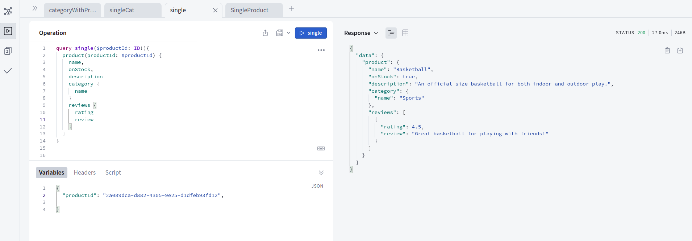
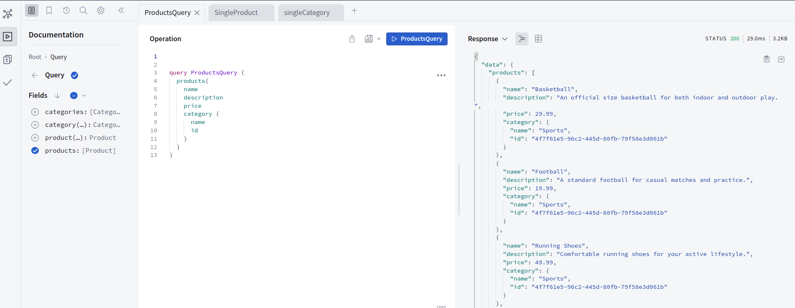
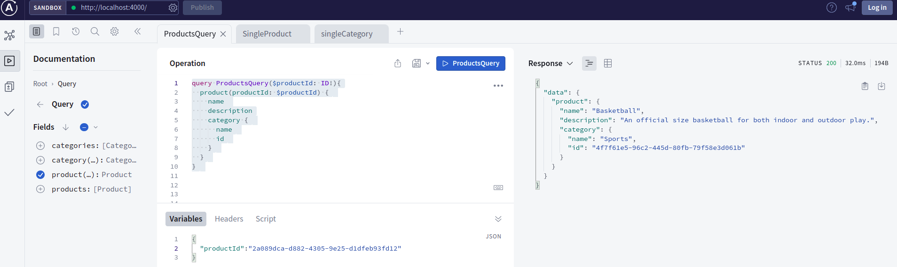
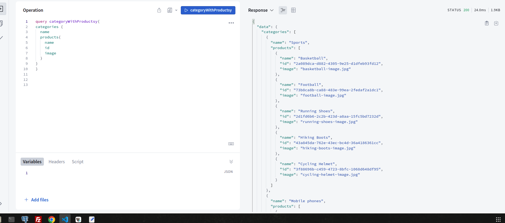
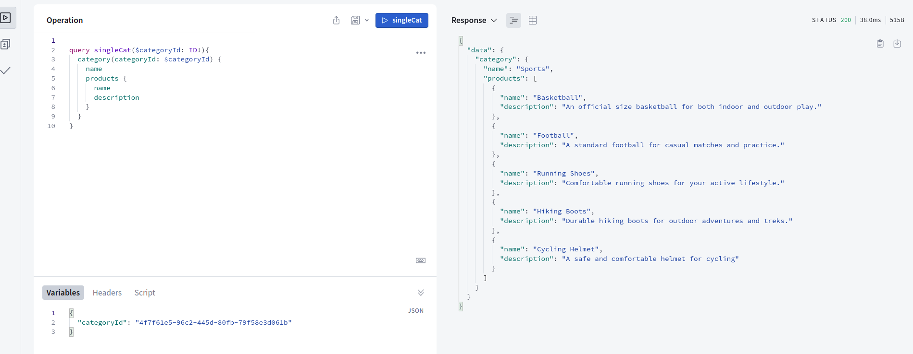
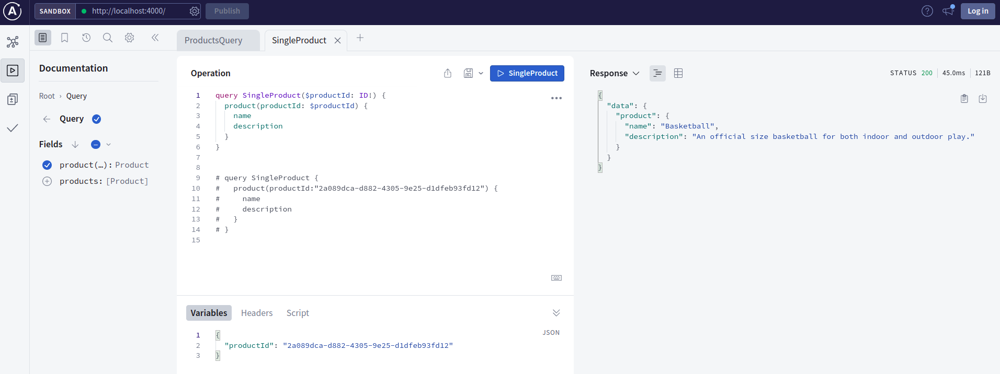
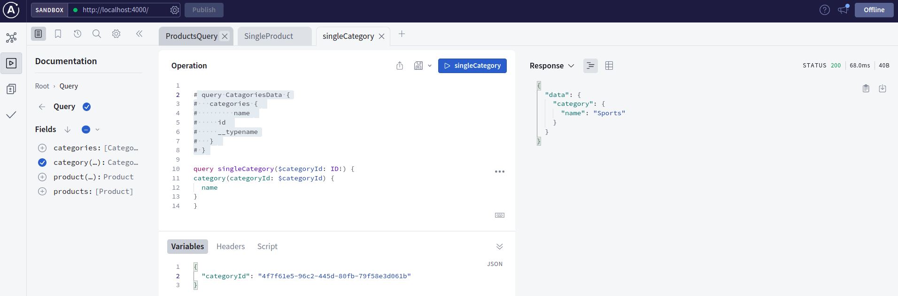

### Branches:

- 3🏷️ [1-1 and 1-many relationship of product and category](https://github.com/bappasahabapi/graphQL/tree/bappa/03/relationship)
- 2🏷️ [Project File Structure](https://github.com/bappasahabapi/graphQL/tree/bappa/02/file-structure)
- 1🏷️ [Products](https://github.com/bappasahabapi/graphQL/tree/bappa/01/schema)
- 0🏷️ [Main](https://github.com/bappasahabapi/graphQL)

### Full installation instructions.

- https://www.apollographql.com/docs/apollo-server/getting-started

### Run the server

- `npm start`
- [🚀 Server ready at: http://localhost:4000/]
- `npm run compile`

## working through documentation

- [Schema Basic](https://www.apollographql.com/docs/apollo-server/schema/schema/#scalar-types)

What we do:

**⚙️ Relationship Product -> category -> review (one-to-many)**

- 🏷️ **GET all product**
  
- 🏷️ **GET single product**
  

**⚙️ Relationship Product to category (one-to-one)**

- 🏷️ **GET all product and based on their category**
  
- 🏷️ **GET single product based on their category**
  

**⚙️ Relationship category to Product  (one-to-many)**

- 🏷️ **GET all product and based on their category**

  
- 🏷️ **GET single product based on their category**
  

**⚙️ Products**

- 🏷️ **GET all products**
  
- 🏷️ **GET single product**
  

**⚙️ Categories**

- 🏷️ **GET all categories**
  

- 🏷️ **GET single**
  
